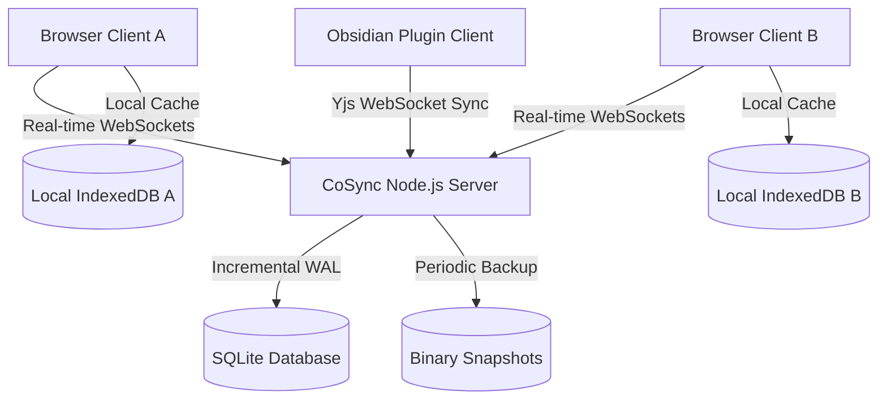

# ✍️ CoSync — Collaborative Sync & Workspace Platform

<p align="center">
  
  
  
  
  
  
</p>

CoSync is a **production-grade, local-first real-time collaborative workspace** resembling modern platforms like Notion and Obsidian. Powered by **Yjs (CRDTs)** for conflict-free multi-user editing and **SQLite** for robust backend persistence, CoSync bridges the gap between browser-based collaborative docs and local markdown files via a custom Obsidian plugin.

---

## 🌟 Key Features

*   📂 **Hierarchical Folders & File Tree:** A clean Notion/Obsidian-style file navigation tree. Create, rename, delete workspaces (folders), and documents directly in place.
*   📐 **Resizable Sidebar:** Drag and resize the sidebar width smoothly with a glowing neon visual handler (saves configuration to `localStorage`).
*   🌗 **Adaptive Light & Dark Themes:** Sleek glassmorphism theme featuring beautiful radial mesh gradient background. Toggle modes instantly.
*   🔗 **Smart Link Invitations:** Share folders or documents via instant join links (`?invite=inv-xxx&docId=doc-yyy`). Non-logged-in users are seamlessly onboarded.
*   ✍️ **Rich Collaborative Editor:** Full rich-text TipTap editor featuring multi-user cursor presence, caretaker name badges, and inline styling.
    *   *Supported Formats:* Bold, Italic, Strikethrough, Inline Code, Headings (H1/H2), Bullet & Numbered lists, Blockquotes, Code Blocks, and Divider lines.
*   🔌 **Obsidian Plugin Integration:** Connects your local Obsidian vault to the real-time cloud server. Edit offline or online synchronously.
*   🛡️ **Enterprise Backend Architecture:** Incremental Yjs binary logs, SQLite WAL write queues, automatic snapshots, features logging, and crash-recovery scripts.

---

## 📐 Architecture & Sync Flow

CoSync utilizes Conflict-free Replicated Data Types (CRDTs) to guarantee zero-conflict merges even during offline editing sessions.



---

## ⚙️ Quick Start & Installation

### Prerequisites
*   [Node.js](https://nodejs.org/) (v18.0 or higher)
*   npm (v9.0 or higher)

### 1. Installation
Clone the repository, go into the root directory, and install all package dependencies inside the workspaces:
```bash
npm run install:all
```

### 2. Configure Environment variables
Create a `.env` file in the `backend/` directory:
```env
PORT=4000
DATABASE_URL=data/sync.db
JWT_SECRET=super_secret_jwt_key
ENABLE_BACKUPS=true
```

Create a `.env` file in the `frontend/` directory:
```env
VITE_BACKEND_URL=http://localhost:4000
```

### 3. Run Development Servers

To run the **Backend Database & WebSocket Server**:
```bash
npm run dev:backend
```

To run the **Frontend Web App** (Vite + React Hot Reloading):
```bash
npm run dev:frontend
```

Now open [http://localhost:5173](http://localhost:5173) in your browser!

---

## 🏗️ Production Build

To build all packages (frontend, backend, and Obsidian plugin) for production deployments:
```bash
npm run build:all
```

---

## 🔌 Setting up the Obsidian Plugin

1.  Navigate to the `obsidian-plugin/` folder.
2.  Install dependencies and build the plugin:
    ```bash
    npm install
    npm run build
    ```
3.  Copy the compiled files (`main.js`, `manifest.json`, and `styles.css`) into your Obsidian vault's plugin directory: `<vault>/.obsidian/plugins/cosync-collaborative/`.
4.  Open Obsidian settings, enable **Community Plugins**, and turn on **CoSync Collaboration**.
5.  Configure the server URL (`http://localhost:4000`) and login credentials to start collaborating on your vault notes!

---

## 🛡️ License

This project is licensed under the MIT License - see the [LICENSE](LICENSE) file for details.
